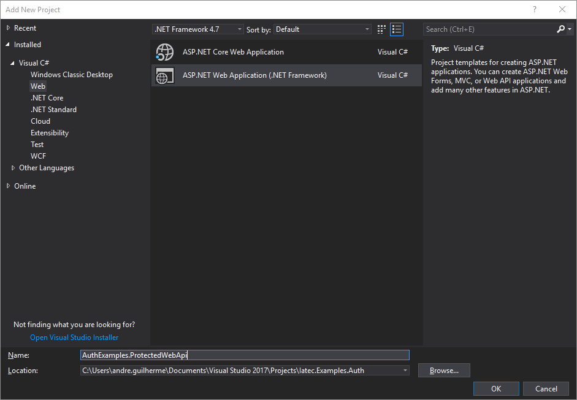
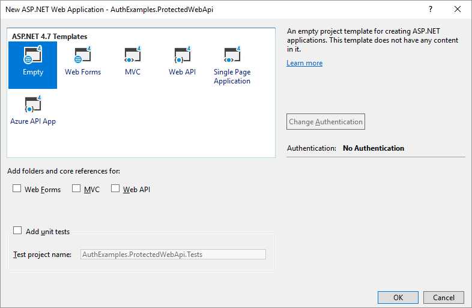

Protect an ASP.NET Web API
################################################################################
In this guide we will create a simple OWIN project and add to it's pipeline a simple web API and then add a middleware that provides authentication for the API methods.

The complete source code can be accessed in `GitHub <https://github.com/iatec-docs/Examples.Auth.DotNet>`__.

.. note:: If you already have an OWIN web API, you can advance some steps and check the section :ref:`ref-protect-existing` directly.

Creating an OWIN web API
********************************************************************************

.. warning:: If you are using a different version or another editor/IDE,
  please keep in mind that this guide was build using Visual Studio 2017,
  and some features might be missing or in different places in different versions.

Creating the project
================================================================================

Open your Visual Studio and create a new project.
In the *Add New Project* dialog choose the **ASP.NET Web Application (.NET Framework)** project type.

  Add New Project dialog.

The Visual Studio will ask you for a template. Select **Empty**.

  Template selection dialog.

.. note::
  For convenience, this guides assumes the project is configured to run on the port ``4000``.
  You can set this in your project accessing the project's *Properties*, selecting the tab **Web** and changing the **Project Url** field to ``http://localhost:4000/``.

Creating the Startup file
================================================================================
First, you must install the following NuGet package: `Microsoft.Owin.Host.SystemWeb <https://www.nuget.org/packages/Microsoft.Owin.Host.SystemWeb/>`__.

.. note:: More information on installing NuGet packages can be found in the `NuGet Quickstart <https://docs.microsoft.com/en-us/nuget/quickstart/use-a-package>`__.

In the *Solution Explorer*, right-click over the project and select *Add > OWIN Startup class*. A dialog will ask for the class name; this guide uses the name ``Startup``.

.. note:: This menu item might not be available if using older versions of Visual Studio or other editors.
  More information on creating OWIN Startup files can be found in the respective `ASP.NET Documentation <https://docs.microsoft.com/en-us/aspnet/aspnet/overview/owin-and-katana/owin-startup-class-detection>`__.

Adding the WebApi middleware to the pipeline
================================================================================
Please, install the following NuGet package: `Microsoft.AspNet.WebApi.Owin <https://www.nuget.org/packages/Microsoft.AspNet.WebApi.Owin/>`__.

Then, you need to add this to ``Configure`` in the **Startup** file:

.. code-block:: C#
  :linenos:

  public void Configuration(IAppBuilder app)
  {
      var httpConfig = new HttpConfiguration();
      httpConfig.MapHttpAttributeRoutes();
      app.UseWebApi(httpConfig);
  }

Creating a simple controller
================================================================================
Create a new file named `DemoController.cs` and add the following code:

.. code-block:: C#
  :linenos:

  using System;
  using System.Collections.Generic;
  using System.Linq;
  using System.Security.Claims;
  using System.Web;
  using System.Web.Http;

  namespace AuthExamples.ProtectedWebApi.Controllers
  {
      [RoutePrefix("demo")]
      public class DemoController : ApiController
      {
          [HttpGet, Route("test")]
          public IHttpActionResult Test()
          {
              return Ok("Hello World");
          }
      }
  }

.. _ref-protect-existing:

Protecting an existing web API
********************************************************************************

Denying Unauthenticated Requests
================================================================================
If you alreay have a working web API that works on top of OWIN (e.g. the simple one that was build in the previous steps),
you can avoid unwanted access by adding the attribute ``[Authorize]`` immediately before the action (method) or controller (class) that you want to protect.
This will deny all unauthenticated access.

As an example, the simple controller created in the previous topics could become the following:

.. code-block:: C#
  :linenos:
  :emphasize-lines: 1

  [Authorize]
  [RoutePrefix("demo")]
  public class DemoController : ApiController
  {
      [HttpGet, Route("test")]
      public IHttpActionResult Test()
      {
          var claims = (User as ClaimsPrincipal).Claims;
          var result = claims.Select(x => new { x.Type, x.Value });
          return Ok(result);
      }
  }

.. note:: For more information on using the ``Authorize`` attribute, check the proper `documentation on MSDN <https://docs.microsoft.com/en-us/aspnet/web-api/overview/security/authentication-and-authorization-in-aspnet-web-api#using-the-authorize-attribute>`__.

Now, a request to the address http://localhost:4000/demo/test will be responded
with the HTTP status code ``401``, that means Unauthorized, because authentication info was not provided in the request.

Accepting Bearer Tokens in the Authorization Header
================================================================================
The most common and recommended way to present a token to a protected API is to send a *Bearer Token* through the ``Authorization`` header.

After the client of your API obtains a token by using the one of the OIDC flows,
it should present the token (e.g. ``tokenvalue0001``) to your API in the ``Authorization`` request header field
in the following format: ``Bearer tokenvalue0001``.

.. note:: More info on **Bearer Tokens** are available in the `RFC 6750 <https://tools.ietf.org/html/rfc6750>`__.

In order to accept and process the provided token, you must reference in your API the package
`IdentityServer3.AccessTokenValidation <https://github.com/IdentityServer/IdentityServer3.AccessTokenValidation>`__
and add the following highlighted lines into the startup class:

.. code-block:: C#
  :linenos:
  :emphasize-lines: 3-5, 7-17

  public void Configuration(IAppBuilder app)
  {
      const string AUTHORITY = "https://login-dev.sdasystems.org/";
      const string SCOPE_NAME = "demoapi";
      const string SCOPE_SECRET = "secret123"

      var idsrvAuthOptions = new IdentityServerBearerTokenAuthenticationOptions
      {
          Authority = AUTHORITY,
          ClientId = SCOPE_NAME,
          ClientSecret = SCOPE_SECRET,
          RequiredScopes = new[] { SCOPE_NAME },

          // validates the token in the server in order to provide single-sign-off
          ValidationMode = ValidationMode.ValidationEndpoint,
      };
      app.UseIdentityServerBearerTokenAuthentication(idsrvAuthOptions);

      var httpConfig = new HttpConfiguration();
      httpConfig.MapHttpAttributeRoutes();
      app.UseWebApi(httpConfig);
  }

This way, when your API is called specifying a Bearer Token,
your API will make a request to the IATec Authentication Server in order to
"introspect" the token, that is, to retrieve the unmasked value for the token.

If the token is valid, the current thread Principal will be set, and therefore
the ``[Authorize]`` attribute will not abort the request.

.. warning:: If you intend to call this API from a browser, you might need to
   activate CORS support in the API. Such is not inside the scope of this guide.
   You may try using the following package: `Microsoft.AspNet.WebApi.Cors <https://www.nuget.org/packages/Microsoft.AspNet.WebApi.Cors>`__.

Retrieving token information in the API
********************************************************************************
By default, all tokens issued by the IATec Authentication Server are by reference,
it means that its value is masked. As stated previously, on each API request, another
request will be made to the authentication server and the resulting information
will be stored in the current thread Principal.

.. note:: For more information about the ASP.NET Principal, check the `official documentation on MSDN <https://docs.microsoft.com/en-us/dotnet/standard/security/principal-and-identity-objects>`__.

In order to access this, you can use the controller's ``User`` property.
Type-casting it to a ``ClaimsPrincipal`` will enable you to retrieve the Access Token claims.

The following modification on your controller exemplifies this. When requested,

.. code-block:: C#
  :linenos:

  [Authorize]
  [RoutePrefix("demo")]
  public class DemoController : ApiController
  {
      [HttpGet, Route("test")]
      public IHttpActionResult Test()
      {
          var claims = (User as ClaimsPrincipal).Claims;
          var result = claims.Select(x => new { x.Type, x.Value });
          return Ok(result);
      }
  }

.. note:: For samples values of Access Tokens, check the section :ref:`ref-access-tokens`.
