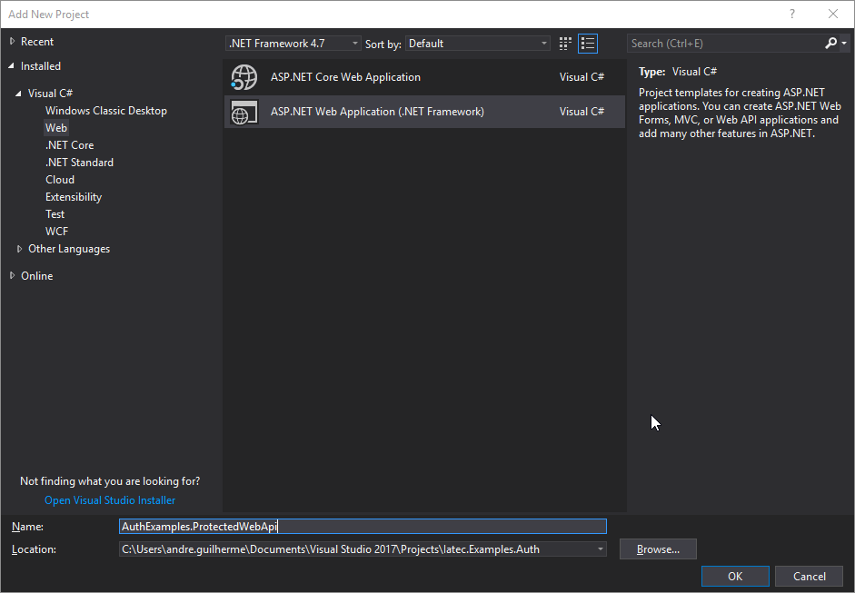
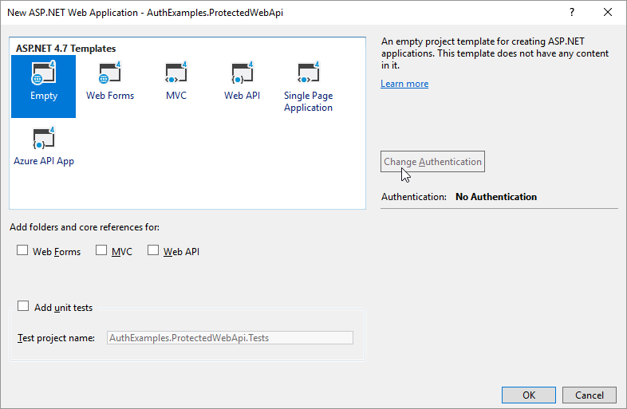

Creating a protected web API with ASP.NET
################################################################################
In this guide we will create a simple OWIN project and add to it's pipeline a simple web API and then add a middleware that provides authentication for the API methods.

.. note::  If you already have an OWIN web API, you can skip some steps and check `Protect an existing web API`_ directly.

Create an OWIN project
********************************************************************************

.. topic:: Create a new project

.. note:: This guide was build using Visual Studio 2017.

Open your Visual Studio and create a new project.
In the *Add New Project* dialog choose the **ASP.NET Web Application (.NET Framework)** project type.

  Add New Project dialog.

The Visual Studio will ask you for a template. Select **Empty**.

  Template selection dialog.

Protect an existing web API
********************************************************************************

.. todo:: fill in details
  .. 
  .. Install-Package IdentityServer3.AccessTokenValidation (https://github.com/IdentityServer/IdentityServer3.AccessTokenValidation)
  .. Change Startup
  .. Add Authorize

Access the user identity in the API
********************************************************************************
.. todo:: fill in details

.. - create project
.. - change port
.. - Configure owin
.. Install-Package Microsoft.Owin.Host.SystemWeb
.. https://docs.microsoft.com/en-us/aspnet/aspnet/overview/owin-and-katana/owin-startup-class-detection
.. - * Remove unused packages
.. - Add web api
.. - Protect
