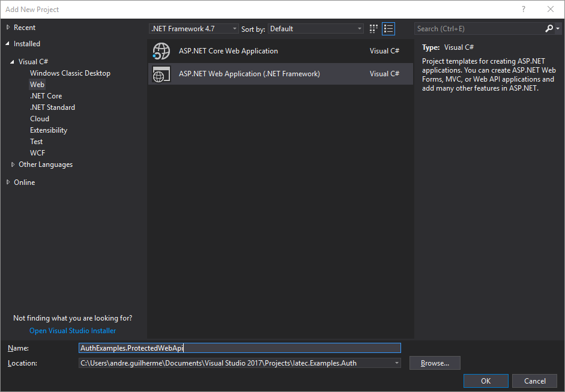

Protected web API with ASP.NET
################################################################################
In this guide we will create a simple OWIN project and add to it's pipeline a simple web API and then add a middleware that provides authentication for the API methods.

.. note:: If you already have an OWIN web API, you can skip some steps and check `Protecting an existing web API`_ directly.

Creating an OWIN web API
********************************************************************************

.. note:: This guide was build using Visual Studio 2017.

Creating the project
================================================================================

Open your Visual Studio and create a new project.
In the *Add New Project* dialog choose the **ASP.NET Web Application (.NET Framework)** project type.

  Add New Project dialog.

The Visual Studio will ask you for a template. Select **Empty**.

.. figure:: img/1_aspnet_template.png

  Template selection dialog.

.. note::
  For convenience, this guides assumes the project is configured to run on the port ``4000``.
  You can set this in your project accessing the project's *Properties*, selecting the tab **Web** and changing the **Project Url** field to ``http://localhost:4000/``.

Creating the Startup file
================================================================================
First, you must install the following NuGet package: `Microsoft.Owin.Host.SystemWeb <https://www.nuget.org/packages/Microsoft.Owin.Host.SystemWeb/>`_.

.. note:: More information on installing NuGet packages can be found in the `NuGet Quickstart <https://docs.microsoft.com/en-us/nuget/quickstart/use-a-package>`_.

In the *Solution Explorer*, right-click over the project and select *Add > OWIN Startup class*. A dialog will ask for the class name; this guide uses the name ``Startup``.

.. note:: This menu item might not be available if using older versions of Visual Studio or other editors.
  More information on creating OWIN Startup files can be found in the respective `ASP.NET Documentation <https://docs.microsoft.com/en-us/aspnet/aspnet/overview/owin-and-katana/owin-startup-class-detection>`_.

Adding the WebApi middleware to the pipeline
================================================================================
Please, install the following NuGet package: `Microsoft.AspNet.WebApi.Owin <https://www.nuget.org/packages/Microsoft.AspNet.WebApi.Owin/>`_.

Then, you need to add this to ``Configure`` in the **Startup** file::

  public void Configuration(IAppBuilder app)
  {
      var httpConfig = new HttpConfiguration();
      httpConfig.MapHttpAttributeRoutes();
      app.UseWebApi(httpConfig);
  }

Creating a simple controller
================================================================================
Create a new file named `DemoController.cs` and add the following code::

  using System;
  using System.Collections.Generic;
  using System.Linq;
  using System.Security.Claims;
  using System.Web;
  using System.Web.Http;

  namespace AuthExamples.ProtectedWebApi.Controllers
  {
      [RoutePrefix("demo")]
      public class DemoController : ApiController
      {
          [HttpGet, Route("test")]
          public IHttpActionResult Test()
          {
              return Ok("Hello World");
          }
      }
  }

Protecting an existing web API
********************************************************************************

================================================================================

================================================================================

.. todo:: fill in details
  ..
  .. Install-Package IdentityServer3.AccessTokenValidation (https://github.com/IdentityServer/IdentityServer3.AccessTokenValidation)
  .. Change Startup
  .. Add Authorize

Accessing the user identity in the API
********************************************************************************
.. todo:: fill in details

.. - Configure owin
.. - * Remove unused packages
.. - Add web api
.. - Protect
